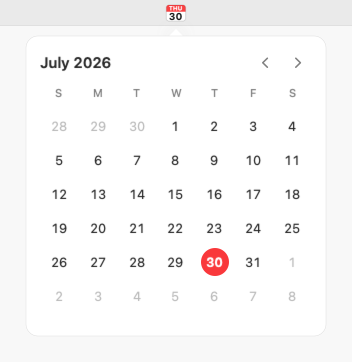
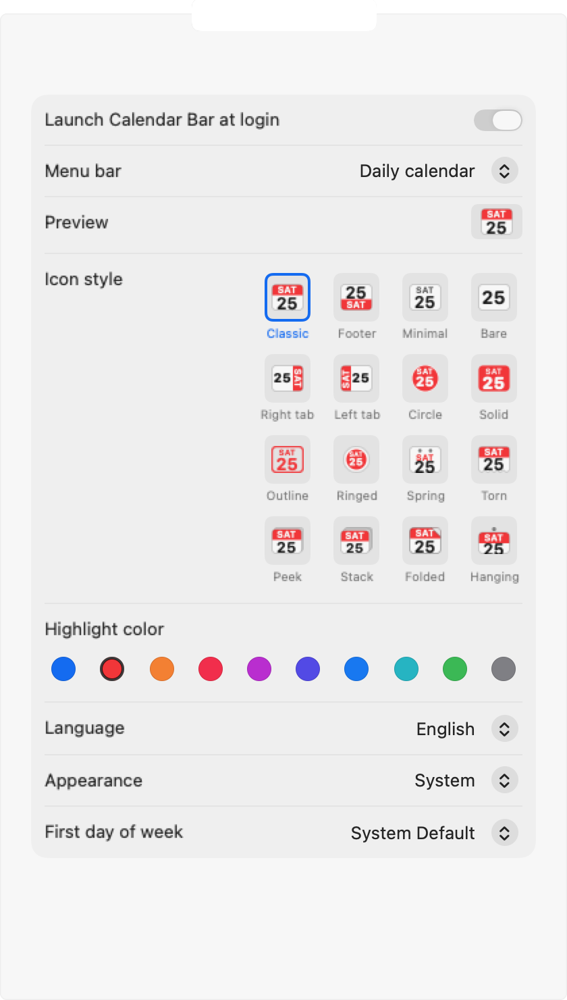

# Calendar Bar

**Click the date. See the month.**

A minimal, native monthly calendar for people who keep their Mac menu bar clean.
No events, no accounts, no network.

   

<picture>
  <source media="(prefers-color-scheme: dark)" srcset="assets/hero-dark.png">
  
</picture>

[**Visit the website →**](https://dennykim123.github.io/calendar-bar)

---

## What it does

|  |  |
|---|---|
| **Opens in one click** | Click the menu bar item and the month is there. Move around with the arrows, a scroll, a trackpad swipe, or the keyboard. |
| **Stays out of the way** | No Dock icon, no notifications, nothing running in the background. Starts with your Mac and then keeps quiet. |
| **Nothing leaves your Mac** | No accounts, no analytics, no network requests. It never asks for your calendars, contacts, or location. |
| **Yours to set up** | Sixteen menu bar icon shapes, thirteen highlight colours, eight languages, light/dark/system. |

## What it deliberately doesn't do

~~events~~ · ~~calendar sync~~ · ~~accounts~~ · ~~reminders~~ · ~~notifications~~ ·
~~weather~~ · ~~widgets~~ · ~~analytics~~ · ~~ads~~ · ~~subscriptions~~

Every one of these was considered and left out. The question was always the same:
does it make checking the month faster?

## Numbers

| Memory | Idle CPU | Download | Permissions requested |
|---|---|---|---|
| ~26 MB | ~0% | 324 KB | 0 |

## Settings

Show the date, the weekday and date, the month and date — or a little tear-off
calendar icon in any of sixteen shapes and thirteen colours. Pick a display
language, the first day of the week, and whether to follow the system's
appearance or pin it to light or dark.

  

## Install

1. [Download the .dmg](https://github.com/dennykim123/calendar-bar/releases/latest/download/Calendar-Bar-1.0.dmg)
2. Drag **Calendar Bar** to Applications
3. Open it — today's date appears in the menu bar

Signed with a Developer ID and notarised by Apple, so it opens without a
Gatekeeper warning. macOS 14 Sonoma or later, Apple Silicon and Intel.

## Shortcuts

| Input | Action |
|---|---|
| Click the menu bar item | Open or close the calendar |
| `‹` `›` · scroll · two-finger swipe | Previous / next month |
| `←` `→` | Move a day |
| `↑` `↓` | Move a week |
| `Page Up` / `Page Down` | Previous / next month |
| `⌘T` | Jump to today |
| Click the month title | Back to the current month |
| `Esc` or click away | Close |
| Right-click the menu bar item | Settings… / Quit |

## Privacy

Calendar Bar collects nothing — no accounts, no analytics, no network requests,
no access to your calendars, contacts, or location. Everything stays on your Mac.

[Privacy Policy](https://dennykim123.github.io/calendar-bar/privacy.html) ·
[Terms of Use](https://dennykim123.github.io/calendar-bar/terms.html)

---

Made by **supersalt studio** · Found a bug or want something?
[bluepisode@naver.com](mailto:bluepisode@naver.com)

© 2026 supersalt studio

